# Beige Book Sentiment Analysis
## University of Maryland Baltimore Country GES673
### By Richard Heimann
========================================================

This is an R Markdown document. Markdown is a simple formatting syntax for authoring web pages and allows both content as well as the output of any embedded R code chunks within a document. 

The Beige Book (http://www.federalreserve.gov/monetarypolicy/beigebook), more formally called the Summary of Commentary on Current Economic Conditions, is a report published by the United States (US) Federal Research Board (FRB) eight times a year. The report is published by each of the Federal Reserve bank districts ahead of the Federal Open Market committee meeting, and is designed to reflect economic conditions. Despite being a report published by the US FRB the content is rather anecdotal. The report interviews key business contacts, economists, market experts, and others to get their opinion about the economy.

The Beige Book has been in publication since 1985 and is now published online. The data used in this book can be found on GitHub (https://github.com/SocialMediaMininginR/ beigebook), as can the Python code for all the scraping and parsing. An example from the Beige Book (October 2013) full report is below and should give you some idea about the nature of the content. The full report is an aggregated view from the twelve Federal Reserve bank districts.

*Beige Book (October 2013): Consumer spending grew modestly in most Districts. Auto sales continued to be strong, particularly in the New York District where they were said to be increasingly robust. In contrast, Chicago, Kansas City, and Dallas indicated slower growth in auto sales in September.*

The Beige Book differs from Twitter in numerous ways; 
* Not everyone has the freedom to participate,
* The data points are not socially linked,
* Users cannot respond to one another directly. 

For our purposes, however, the most important difference is that the Beige Book contains paragraphs of information per document, rather than being a collection of single sentences, like Twitter.


```
## Warning: dependency 'Rcompression' is not available
```

```
## Loading required package: RCurl
## Loading required package: bitops
## Loading required package: gplots
## KernSmooth 2.23 loaded
## Copyright M. P. Wand 1997-2009
## 
## Attaching package: 'gplots'
## 
## The following object is masked from 'package:stats':
## 
##     lowess
## 
## Loading required package: SnowballC
## Loading required package: RColorBrewer
## Loading required package: ggplot2
## Loading required package: twitteR
## Loading required package: ROAuth
## Loading required package: digest
## Loading required package: rjson
```

```
## Warning: dependencies 'Rcampdf', 'Rgraphviz', 'Rpoppler' are not available
```

```
## Loading required package: tm
```


```
## $`https://raw2.github.com/SocialMediaMininginR/sentiment_function/master/sentiment.R`
## function (sentences, pos.words, neg.words, .progress = "none") 
## {
##     require(plyr)
##     require(stringr)
##     scores = laply(sentences, function(sentence, pos.words, neg.words) {
##         word.list = str_split(sentence, "\\s+")
##         words = unlist(word.list)
##         pos.matches = match(words, pos.words)
##         neg.matches = match(words, neg.words)
##         pos.matches = !is.na(pos.matches)
##         neg.matches = !is.na(neg.matches)
##         score = sum(pos.matches) - sum(neg.matches)
##         return(score)
##     }, pos.words, neg.words, .progress = .progress)
##     scores.df = data.frame(score = scores, text = sentences)
##     return(scores.df)
## }
```


```r
# read.csv() reads a file in table format and creates a data frame from it.
BB <- read.csv("/Users/heimannrichard/Documents/github/beigebook/beigebookdata/BB_96_2013.csv")
BB <- subset(BB, select = -X)
```


```r
# str() compactly display the internal structure of an R object
str(BB)
```

```
## 'data.frame':	1608 obs. of  4 variables:
##  $ location: Factor w/ 12 levels "Atlanta","Boston",..: 10 10 2 2 2 2 2 2 6 9 ...
##  $ year    : int  2011 2011 2012 2012 2012 2012 2012 2012 2012 2011 ...
##  $ month   : int  11 10 8 2 1 7 6 4 8 7 ...
##  $ text    : Factor w/ 1608 levels "according to business contacts in the retail and manufacturing sectors, economic activity in the first district is largely stag"| __truncated__,..: 252 246 640 651 21 641 639 745 138 1052 ...
```


```r
# reformat date field
BB$Date <- as.Date(paste(BB$year, BB$month, BB$day, sep = "-"), format = "%Y-%m-%d")
BB$Date <- strptime(as.character(BB$Date), "%Y-%m-%d")
# colnames() retrieves column names of a matrix-like object.
colnames(BB) <- c("location", "year", "month", "text", "date")
```


```r
# gsub() substitutes character classes that do not give an output such as
# feed, backspace and tabspaces with a space ‘ ‘.  gsub() substitutes
# numerical values with digits of one or greater with a space ‘ ‘.
BB$text <- gsub("[[:punct:]]", " ", BB$text)
BB$text <- gsub("[[:cntrl:]]", " ", BB$text)
BB$text <- gsub("\\d+", " ", BB$text)
```


```r
# the standard stopwords are useful starting points but we may want to add
# corpus specific words
stnd.stopwords <- stopwords("SMART")
# head() returns the first parts of a vector, matrix, table, data frame or
# function.  tail() returns the first parts of a vector, matrix, table, data
# frame or function.
head(stnd.stopwords)
```

```
## [1] "a"         "a's"       "able"      "about"     "above"     "according"
```

```r
tail(stnd.stopwords)
```

```
## [1] "your"       "yours"      "yourself"   "yourselves" "z"         
## [6] "zero"
```

```r
# length() gets or set the length of vectors
length(stnd.stopwords)
```

```
## [1] 571
```


```r
# bb.stopwords is a combination of stnd.stopwords and our custom list.
bb.stopwords <- c(stnd.stopwords, "district", "districts", "reported", "noted", 
    "city", "cited", "activity", "contacts", "chicago", "dallas", "kansas", 
    "san", "richmond", "francisco", "cleveland", "atlanta", "sales", "boston", 
    "york", "philadelphia", "minneapolis", "louis", "services", "year", "levels", 
    " louis")
length(bb.stopwords)
```

```
## [1] 597
```


```r
# pos.words is a combination of pos_all, which was quietly loaded and is
# combination of a generic and a domain specific lexicon and # some words
# which are important to the beige book.
pos.words <- c(pos_all, "spend", "buy", "earn", "hike", "increase", "increases", 
    "development", "expansion", "raise", "surge", "add", "added", "advanced", 
    "advances", "boom", "boosted", "boosting", "waxed", "upbeat", "surge")

# neg.words is a combination of neg_all, which was quietly loaded and is
# combination of a generic and a domain specific lexicon and # some words
# which are important to the beige book.
neg.words <- c(neg_all, "earn", "shortfall", "weak", "fell", "decreases", "decreases", 
    "decreased", "contraction", "cutback", "cuts", "drop", "shrinkage", "reduction", 
    "abated", "cautious", "caution", "damped", "waned", "undermine", "unfavorable", 
    "soft", "softening", "soften", "softer", "sluggish", "slowed", "slowdown", 
    "slower", "recession")
```


```r
head(pos.words)
```

```
## [1] "a+"         "abound"     "abounds"    "abundance"  "abundant"  
## [6] "accessable"
```

```r
head(neg.words)
```

```
## [1] "2-faced"    "2-faces"    "abnormal"   "abolish"    "abominable"
## [6] "abominably"
```


```r
# BB.keeps are the fields we wish to retain after running score.sentiment.
BB.keeps <- BB[, c("location", "date", "year")]
```


```r
# using our score.sentiment function on BB$text (text field) against
# pos.words and neg.words (lexicons).
BB.score <- score.sentiment(BB$text, pos.words, neg.words)
```


```r
# add back BB.keeps to BB.score.
BB.sentiment <- cbind(BB.keeps, BB.score)
```


```r
# colnames shows that we kept “text”, “date”, and “year” field as well as
# the # new column “score”
colnames(BB.sentiment)
```

```
## [1] "location" "date"     "year"     "score"    "text"
```


```r
# calculate mean from raw score
BB.sentiment$mean <- mean(BB.sentiment$score)
# calculate sum and store it in BB.sum
BB.sum <- BB.sentiment$score
# center the data by subtracting BB.sum from BB.sentiment$mean
BB.sentiment$centered <- BB.sum - BB.sentiment$mean
# we can label observations above and below the centered values with 1 and
# code N/A values with 0.
BB.sentiment$pos[BB.sentiment$centered > 0] <- 1
BB.sentiment$neg[BB.sentiment$centered < 0] <- 1
BB.sentiment$neg[is.na(BB.sentiment$neg)] <- 0
BB.sentiment$pos[is.na(BB.sentiment$pos)] <- 0
```


```r
# we can then sum the values
sum(BB.sentiment$pos)
```

```
## [1] 853
```

```r
sum(BB.sentiment$neg)
```

```
## [1] 755
```


```r
# we can create a histogram of raw score and centered score to see the
# impact of mean centering
BB.hist <- hist(BB.sentiment$score, main = "Sentiment Histogram", xlab = "Score", 
    ylab = "Frequency")
```

 

```r
BB.hist <- hist(BB.sentiment$centered, main = "Sentiment Histogram", xlab = "Score", 
    ylab = "Frequency")
```

 


```r
# using the results from the function to score our documents we create a
# boxplot to examine the distribution of opinion relating to economic
# conditions
BB.boxplot <- ggplot(BB.sentiment, aes(x = BB.sentiment$year, y = BB.sentiment$centered, 
    group = BB.sentiment$year)) + geom_boxplot(aes(fill = "grey80"), outlier.colour = "black", 
    outlier.shape = 16, outlier.size = 2) + guides(fill = FALSE)
# add labels to our boxplot using xlab
BB.boxplot <- BB.boxplot + xlab("Year") + ylab("Sentiment (Centered)") + ggtitle("Economic Sentiment - Beige Book (1996-2013)")
# draw boxplot
BB.boxplot
```

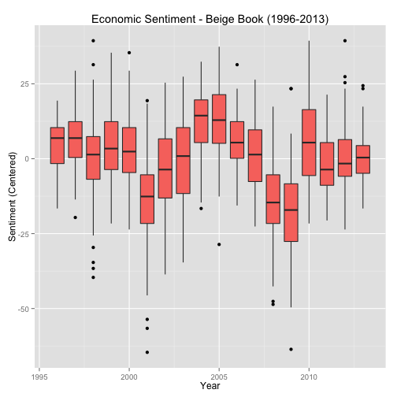 


```r
# this code can be used to add the recession bars shown below where xmin and
# xmax.
rect2001 <- data.frame(xmin = 2001, xmax = 2002, ymin = -Inf, ymax = Inf)
rect2007 <- data.frame(xmin = 2007, xmax = 2009, ymin = -Inf, ymax = Inf)
```


```r
# ggplot is an R package used for advanced plotting.
BB.boxplot <- ggplot(BB.sentiment, aes(x = BB.sentiment$year, y = BB.sentiment$centered, 
    group = BB.sentiment$year))
BB.boxplot <- BB.boxplot + geom_boxplot(outlier.colour = "black", outlier.shape = 16, 
    outlier.size = 2)
BB.boxplot <- BB.boxplot + geom_rect(data = rect2001, aes(xmin = xmin, xmax = xmax, 
    ymin = -Inf, ymax = +Inf), fill = "pink", alpha = 0.2, inherit.aes = FALSE)
BB.boxplot <- BB.boxplot + geom_rect(data = rect2007, aes(xmin = xmin, xmax = xmax, 
    ymin = -Inf, ymax = +Inf), fill = "pink", alpha = 0.2, inherit.aes = FALSE)
BB.boxplot <- BB.boxplot + xlab("Date") + ylab("Sentiment (Centered)") + ggtitle("Economic Sentiment - Beige Book (1996-2013)")
BB.boxplot
```

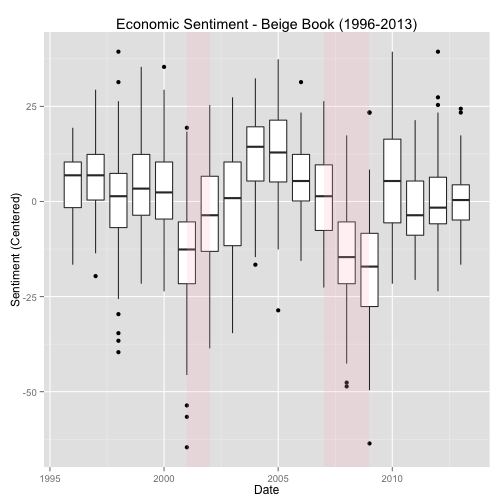 


```r
bb.results <- data.frame()
for (local in unique(BB.sentiment$location)) {
    tmp = subset(BB.sentiment, location == local)
    count = nrow(tmp)
    mean = mean(tmp$centered)
    median = median(tmp$centered)
    bb.results = rbind(bb.results, data.frame(local, count, mean, median))
}
bb.results
```

```
##            local count     mean  median
## 1       Richmond   134  0.91231  2.3825
## 2         Boston   134  2.07649  3.8825
## 3    Kansas City   134  2.40485  2.8825
## 4   Philadelphia   134  5.52425  5.8825
## 5  San Francisco   134  0.69590  2.8825
## 6        Atlanta   134 -2.36381 -1.6175
## 7      Cleveland   134  4.03172  3.3825
## 8      St. Louis   134 -8.17724 -7.6175
## 9       New York   134 -1.11754 -1.1175
## 10   Minneapolis   134 -0.05784  0.3825
## 11       Chicago   134  1.53172  3.3825
## 12        Dallas   134 -5.46082 -3.1175
```


```r
summary(BB.sentiment$score)
```

```
##    Min. 1st Qu.  Median    Mean 3rd Qu.    Max. 
##   -52.0     4.0    14.0    12.6    23.0    52.0
```

```r
summary(BB.sentiment$centered)
```

```
##    Min. 1st Qu.  Median    Mean 3rd Qu.    Max. 
##  -64.60   -8.62    1.38    0.00   10.40   39.40
```


```r
# apply a function to each cell in this case using ?mean, ?var, ?length
tapply(BB.sentiment$score, BB.sentiment$location, mean)
```

```
##       Atlanta        Boston       Chicago     Cleveland        Dallas 
##        10.254        14.694        14.149        16.649         7.157 
##   Kansas City   Minneapolis      New York  Philadelphia      Richmond 
##        15.022        12.560        11.500        18.142        13.530 
## San Francisco     St. Louis 
##        13.313         4.440
```

```r
tapply(BB.sentiment$centered, BB.sentiment$location, mean)
```

```
##       Atlanta        Boston       Chicago     Cleveland        Dallas 
##      -2.36381       2.07649       1.53172       4.03172      -5.46082 
##   Kansas City   Minneapolis      New York  Philadelphia      Richmond 
##       2.40485      -0.05784      -1.11754       5.52425       0.91231 
## San Francisco     St. Louis 
##       0.69590      -8.17724
```

```r
tapply(BB.sentiment$score, BB.sentiment$location, var)
```

```
##       Atlanta        Boston       Chicago     Cleveland        Dallas 
##         171.6         239.1         250.8         146.1         352.2 
##   Kansas City   Minneapolis      New York  Philadelphia      Richmond 
##         193.2         137.3         168.0         184.2         225.5 
## San Francisco     St. Louis 
##         263.1         100.6
```

```r
tapply(BB.sentiment$score, BB.sentiment$location, length)
```

```
##       Atlanta        Boston       Chicago     Cleveland        Dallas 
##           134           134           134           134           134 
##   Kansas City   Minneapolis      New York  Philadelphia      Richmond 
##           134           134           134           134           134 
## San Francisco     St. Louis 
##           134           134
```


```r
# Return subsets of vectors, matrices or data frames which meet conditions.
dallas <- subset(BB.sentiment, location == "Dallas")
stlouis <- subset(BB.sentiment, location == "St. Louis")
atlanta <- subset(BB.sentiment, location == "Atlanta")
ny <- subset(BB.sentiment, location == "New York")
richmond <- subset(BB.sentiment, location == "Richmond")
sf <- subset(BB.sentiment, location == "San Francisco")
kc <- subset(BB.sentiment, location == "Kansas City")
minneapolis <- subset(BB.sentiment, location == "Minneapolis")
chicago <- subset(BB.sentiment, location == "Chicago")
boston <- subset(BB.sentiment, location == "Boston")
cleveland <- subset(BB.sentiment, location == "Cleveland")
phili <- subset(BB.sentiment, location == "Philadelphia")
```


```r
# BB.boxplot.dallas
BB.boxplot.dallas <- ggplot(dallas, aes(x = dallas$year, y = dallas$centered, 
    group = dallas$year))
BB.boxplot.dallas <- BB.boxplot.dallas + geom_boxplot(outlier.colour = "black", 
    outlier.shape = 16, outlier.size = 2) + ylim(-70, 50)
BB.boxplot.dallas <- BB.boxplot.dallas + xlab("Date") + ylab("Sentiment (Centered)") + 
    ggtitle("dallas")
# BB.boxplot.stlouis
BB.boxplot.stlouis <- ggplot(stlouis, aes(x = stlouis$year, y = stlouis$centered, 
    group = stlouis$year))
BB.boxplot.stlouis <- BB.boxplot.stlouis + geom_boxplot(outlier.colour = "black", 
    outlier.shape = 16, outlier.size = 2) + ylim(-50, 50)
BB.boxplot.stlouis <- BB.boxplot.stlouis + xlab("Date") + ylab("Sentiment (Centered)") + 
    ggtitle("stlouis")
# BB.boxplot.atlanta
BB.boxplot.atlanta <- ggplot(atlanta, aes(x = atlanta$year, y = atlanta$centered, 
    group = atlanta$year))
BB.boxplot.atlanta <- BB.boxplot.atlanta + geom_boxplot(outlier.colour = "black", 
    outlier.shape = 16, outlier.size = 2) + ylim(-50, 50)
BB.boxplot.atlanta <- BB.boxplot.atlanta + xlab("Date") + ylab("Sentiment (Centered)") + 
    ggtitle("atlanta")
# BB.boxplot.ny
BB.boxplot.ny <- ggplot(ny, aes(x = ny$year, y = ny$centered, group = ny$year))
BB.boxplot.ny <- BB.boxplot.ny + geom_boxplot(outlier.colour = "black", outlier.shape = 16, 
    outlier.size = 2) + ylim(-50, 50)
BB.boxplot.ny <- BB.boxplot.ny + xlab("Date") + ylab("Sentiment (Centered)") + 
    ggtitle("ny")

BB.boxplot.dallas
```

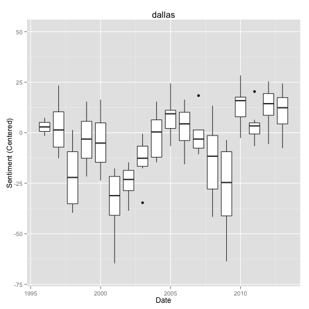 

```r
BB.boxplot.stlouis
```

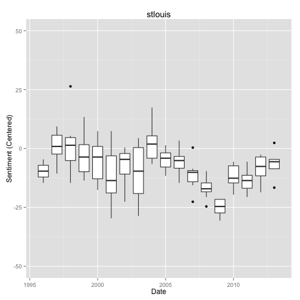 

```r
BB.boxplot.atlanta
```

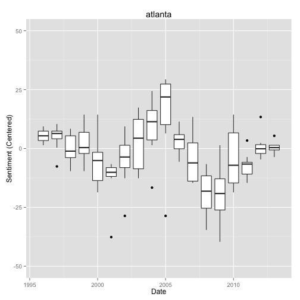 

```r
BB.boxplot.ny
```

```
## Warning: Removed 1 rows containing non-finite values (stat_boxplot).
```

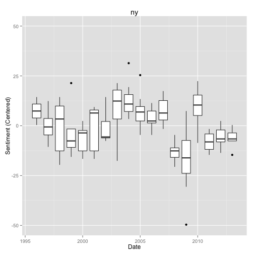 

```r

################ four plots (richmond, sf, kc, minneapolis)

# BB.boxplot.richmond
BB.boxplot.richmond <- ggplot(richmond, aes(x = richmond$year, y = richmond$centered, 
    group = richmond$year))
BB.boxplot.richmond <- BB.boxplot.richmond + geom_boxplot(outlier.colour = "black", 
    outlier.shape = 16, outlier.size = 2) + ylim(-70, 50)
BB.boxplot.richmond <- BB.boxplot.richmond + xlab("Date") + ylab("Sentiment (Centered)") + 
    ggtitle("richmond")
# BB.boxplot.sf
BB.boxplot.sf <- ggplot(sf, aes(x = sf$year, y = sf$centered, group = sf$year))
BB.boxplot.sf <- BB.boxplot.sf + geom_boxplot(outlier.colour = "black", outlier.shape = 16, 
    outlier.size = 2) + ylim(-50, 50)
BB.boxplot.sf <- BB.boxplot.sf + xlab("Date") + ylab("Sentiment (Centered)") + 
    ggtitle("sf")
# BB.boxplot.kc
BB.boxplot.kc <- ggplot(kc, aes(x = kc$year, y = kc$centered, group = kc$year))
BB.boxplot.kc <- BB.boxplot.kc + geom_boxplot(outlier.colour = "black", outlier.shape = 16, 
    outlier.size = 2) + ylim(-50, 50)
BB.boxplot.kc <- BB.boxplot.kc + xlab("Date") + ylab("Sentiment (Centered)") + 
    ggtitle("kc")
# BB.boxplot.minneapolis
BB.boxplot.minneapolis <- ggplot(minneapolis, aes(x = minneapolis$year, y = minneapolis$centered, 
    group = minneapolis$year))
BB.boxplot.minneapolis <- BB.boxplot.minneapolis + geom_boxplot(outlier.colour = "black", 
    outlier.shape = 16, outlier.size = 2) + ylim(-50, 50)
BB.boxplot.minneapolis <- BB.boxplot.minneapolis + xlab("Date") + ylab("Sentiment (Centered)") + 
    ggtitle("minneapolis")

BB.boxplot.richmond
```

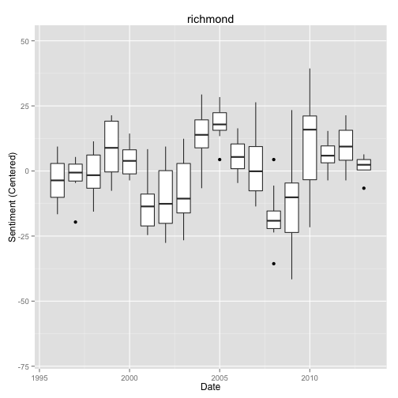 

```r
BB.boxplot.sf
```

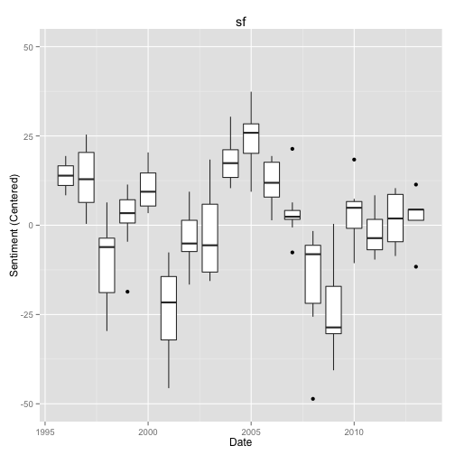 

```r
BB.boxplot.kc
```

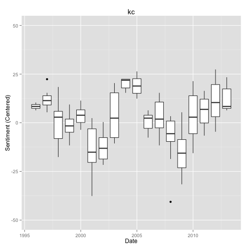 

```r
BB.boxplot.minneapolis
```

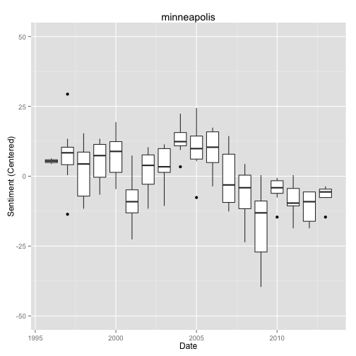 

```r

################ four plots (chicago, boston, cleveland, phili)

# BB.boxplot.chicago
BB.boxplot.chicago <- ggplot(chicago, aes(x = chicago$year, y = chicago$centered, 
    group = chicago$year))
BB.boxplot.chicago <- BB.boxplot.chicago + geom_boxplot(outlier.colour = "black", 
    outlier.shape = 16, outlier.size = 2) + ylim(-70, 50)
BB.boxplot.chicago <- BB.boxplot.chicago + xlab("Date") + ylab("Sentiment (Centered)") + 
    ggtitle("chicago")
# BB.boxplot.boston
BB.boxplot.boston <- ggplot(boston, aes(x = boston$year, y = boston$centered, 
    group = boston$year))
BB.boxplot.boston <- BB.boxplot.boston + geom_boxplot(outlier.colour = "black", 
    outlier.shape = 16, outlier.size = 2) + ylim(-50, 50)
BB.boxplot.boston <- BB.boxplot.boston + xlab("Date") + ylab("Sentiment (Centered)") + 
    ggtitle("boston")
# BB.boxplot.cleveland
BB.boxplot.cleveland <- ggplot(cleveland, aes(x = cleveland$year, y = cleveland$centered, 
    group = cleveland$year))
BB.boxplot.cleveland <- BB.boxplot.cleveland + geom_boxplot(outlier.colour = "black", 
    outlier.shape = 16, outlier.size = 2) + ylim(-50, 50)
BB.boxplot.cleveland <- BB.boxplot.cleveland + xlab("Date") + ylab("Sentiment (Centered)") + 
    ggtitle("cleveland")
# BB.boxplot.phili
BB.boxplot.phili <- ggplot(phili, aes(x = phili$year, y = phili$centered, group = phili$year))
BB.boxplot.phili <- BB.boxplot.phili + geom_boxplot(outlier.colour = "black", 
    outlier.shape = 16, outlier.size = 2) + ylim(-50, 50)
BB.boxplot.phili <- BB.boxplot.phili + xlab("Date") + ylab("Sentiment (Centered)") + 
    ggtitle("phili")

BB.boxplot.chicago
```

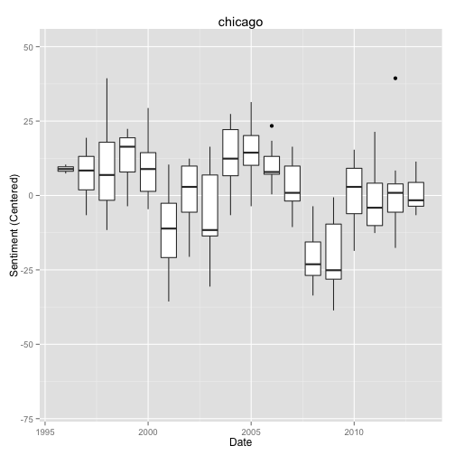 

```r
BB.boxplot.boston
```

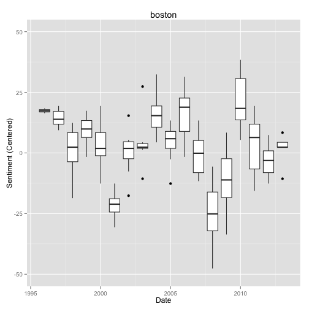 

```r
BB.boxplot.cleveland
```

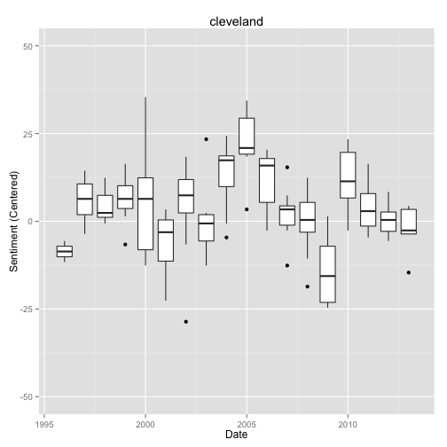 

```r
BB.boxplot.phili
```

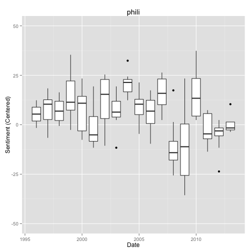 


Distributions are skewed, there are outliers, and homogeneity is out the window! 


```r
# plot group means and confidence intervals requires {gplots}
plotmeans(BB.sentiment$centered ~ BB.sentiment$location, xlab = "Cities", ylab = "Sentiment Centered", 
    main = "Mean Plot with 95% CI") + abline(h = 0)
```

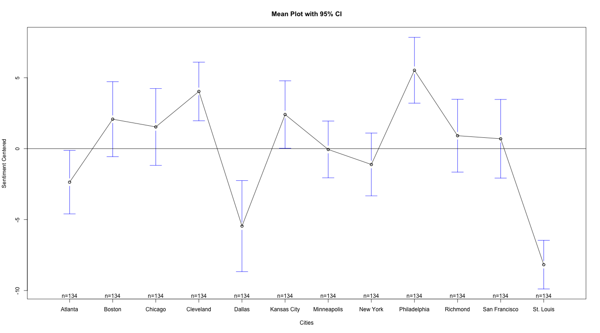 

```
## numeric(0)
```


Levene (1960) proposed a test for homogeneity of variances in k groups which is based on the ANOVA statistic applied to absolute deviations of observations from the corresponding group mean/median/trimmed mean. The robust Brown-Forsythe version of the Levene-type test substites the group mean by the group median in the classical Levene statistic. The third option is to consider ANOVA applied to the absolute deviations of observations from the group trimmed mean instead of the group means.

Analysis of variance (ANOVA) is a classical test that accounts for difference of means across groups. 


```
## Error: trying to use CRAN without setting a mirror
```

```
## Loading required package: car
```


```r
leveneTest(BB.sentiment$score ~ BB.sentiment$location, data = BB.sentiment, 
    center = "mean")
```

```
## Levene's Test for Homogeneity of Variance (center = "mean")
##         Df F value  Pr(>F)    
## group   11    5.95 1.4e-09 ***
##       1596                    
## ---
## Signif. codes:  0 '***' 0.001 '**' 0.01 '*' 0.05 '.' 0.1 ' ' 1
```

```r
leveneTest(BB.sentiment$score ~ BB.sentiment$location, data = BB.sentiment, 
    center = "mean", trim = 0.1)
```

```
## Levene's Test for Homogeneity of Variance (center = "mean": 0.1)
##         Df F value  Pr(>F)    
## group   11     5.7 4.5e-09 ***
##       1596                    
## ---
## Signif. codes:  0 '***' 0.001 '**' 0.01 '*' 0.05 '.' 0.1 ' ' 1
```

```r
leveneTest(BB.sentiment$score ~ BB.sentiment$location, data = BB.sentiment, 
    center = "median")
```

```
## Levene's Test for Homogeneity of Variance (center = "median")
##         Df F value  Pr(>F)    
## group   11    5.57 8.3e-09 ***
##       1596                    
## ---
## Signif. codes:  0 '***' 0.001 '**' 0.01 '*' 0.05 '.' 0.1 ' ' 1
```


```r
# oneway.test tests whether multiples samples have the same means; variances
# are not necessarily assumed to be equal.  gives same results as anova(lm(y
# ~ x, data = data))
bb.oneway <- oneway.test(BB.sentiment$score ~ BB.sentiment$location, data = BB.sentiment)
bb.aov <- aov(BB.sentiment$score ~ BB.sentiment$location, data = BB.sentiment)
```


```r
summary(bb.oneway)
```

```
##           Length Class  Mode     
## statistic 1      -none- numeric  
## parameter 2      -none- numeric  
## p.value   1      -none- numeric  
## method    1      -none- character
## data.name 1      -none- character
```

```r
summary(bb.aov)
```

```
##                         Df Sum Sq Mean Sq F value Pr(>F)    
## BB.sentiment$location   11  21984    1999    9.86 <2e-16 ***
## Residuals             1596 323432     203                   
## ---
## Signif. codes:  0 '***' 0.001 '**' 0.01 '*' 0.05 '.' 0.1 ' ' 1
```

```r
TukeyHSD(bb.aov)
```

```
##   Tukey multiple comparisons of means
##     95% family-wise confidence level
## 
## Fit: aov(formula = BB.sentiment$score ~ BB.sentiment$location, data = BB.sentiment)
## 
## $`BB.sentiment$location`
##                                diff      lwr     upr  p adj
## Boston-Atlanta               4.4403  -1.2518 10.1324 0.3078
## Chicago-Atlanta              3.8955  -1.7966  9.5876 0.5206
## Cleveland-Atlanta            6.3955   0.7034 12.0876 0.0130
## Dallas-Atlanta              -3.0970  -8.7891  2.5951 0.8285
## Kansas City-Atlanta          4.7687  -0.9234 10.4607 0.2068
## Minneapolis-Atlanta          2.3060  -3.3861  7.9980 0.9758
## New York-Atlanta             1.2463  -4.4458  6.9383 0.9999
## Philadelphia-Atlanta         7.8881   2.1960 13.5801 0.0004
## Richmond-Atlanta             3.2761  -2.4160  8.9682 0.7695
## San Francisco-Atlanta        3.0597  -2.6324  8.7518 0.8397
## St. Louis-Atlanta           -5.8134 -11.5055 -0.1214 0.0402
## Chicago-Boston              -0.5448  -6.2369  5.1473 1.0000
## Cleveland-Boston             1.9552  -3.7369  7.6473 0.9936
## Dallas-Boston               -7.5373 -13.2294 -1.8452 0.0009
## Kansas City-Boston           0.3284  -5.3637  6.0204 1.0000
## Minneapolis-Boston          -2.1343  -7.8264  3.5577 0.9868
## New York-Boston             -3.1940  -8.8861  2.4980 0.7976
## Philadelphia-Boston          3.4478  -2.2443  9.1398 0.7055
## Richmond-Boston             -1.1642  -6.8563  4.5279 1.0000
## San Francisco-Boston        -1.3806  -7.0727  4.3115 0.9997
## St. Louis-Boston           -10.2537 -15.9458 -4.5617 0.0000
## Cleveland-Chicago            2.5000  -3.1921  8.1921 0.9560
## Dallas-Chicago              -6.9925 -12.6846 -1.3005 0.0035
## Kansas City-Chicago          0.8731  -4.8189  6.5652 1.0000
## Minneapolis-Chicago         -1.5896  -7.2816  4.1025 0.9990
## New York-Chicago            -2.6493  -8.3413  3.0428 0.9343
## Philadelphia-Chicago         3.9925  -1.6995  9.6846 0.4801
## Richmond-Chicago            -0.6194  -6.3115  5.0727 1.0000
## San Francisco-Chicago       -0.8358  -6.5279  4.8563 1.0000
## St. Louis-Chicago           -9.7090 -15.4010 -4.0169 0.0000
## Dallas-Cleveland            -9.4925 -15.1846 -3.8005 0.0000
## Kansas City-Cleveland       -1.6269  -7.3189  4.0652 0.9988
## Minneapolis-Cleveland       -4.0896  -9.7816  1.6025 0.4403
## New York-Cleveland          -5.1493 -10.8413  0.5428 0.1213
## Philadelphia-Cleveland       1.4925  -4.1995  7.1846 0.9994
## Richmond-Cleveland          -3.1194  -8.8115  2.5727 0.8216
## San Francisco-Cleveland     -3.3358  -9.0279  2.3563 0.7479
## St. Louis-Cleveland        -12.2090 -17.9010 -6.5169 0.0000
## Kansas City-Dallas           7.8657   2.1736 13.5577 0.0004
## Minneapolis-Dallas           5.4030  -0.2891 11.0951 0.0816
## New York-Dallas              4.3433  -1.3488 10.0354 0.3422
## Philadelphia-Dallas         10.9851   5.2930 16.6772 0.0000
## Richmond-Dallas              6.3731   0.6811 12.0652 0.0136
## San Francisco-Dallas         6.1567   0.4646 11.8488 0.0210
## St. Louis-Dallas            -2.7164  -8.4085  2.9757 0.9224
## Minneapolis-Kansas City     -2.4627  -8.1548  3.2294 0.9605
## New York-Kansas City        -3.5224  -9.2145  2.1697 0.6760
## Philadelphia-Kansas City     3.1194  -2.5727  8.8115 0.8216
## Richmond-Kansas City        -1.4925  -7.1846  4.1995 0.9994
## San Francisco-Kansas City   -1.7090  -7.4010  3.9831 0.9980
## St. Louis-Kansas City      -10.5821 -16.2742 -4.8900 0.0000
## New York-Minneapolis        -1.0597  -6.7518  4.6324 1.0000
## Philadelphia-Minneapolis     5.5821  -0.1100 11.2742 0.0605
## Richmond-Minneapolis         0.9701  -4.7219  6.6622 1.0000
## San Francisco-Minneapolis    0.7537  -4.9383  6.4458 1.0000
## St. Louis-Minneapolis       -8.1194 -13.8115 -2.4273 0.0002
## Philadelphia-New York        6.6418   0.9497 12.3339 0.0077
## Richmond-New York            2.0299  -3.6622  7.7219 0.9913
## San Francisco-New York       1.8134  -3.8786  7.5055 0.9967
## St. Louis-New York          -7.0597 -12.7518 -1.3676 0.0030
## Richmond-Philadelphia       -4.6119 -10.3040  1.0801 0.2518
## San Francisco-Philadelphia  -4.8284 -10.5204  0.8637 0.1911
## St. Louis-Philadelphia     -13.7015 -19.3936 -8.0094 0.0000
## San Francisco-Richmond      -0.2164  -5.9085  5.4757 1.0000
## St. Louis-Richmond          -9.0896 -14.7816 -3.3975 0.0000
## St. Louis-San Francisco     -8.8731 -14.5652 -3.1811 0.0000
```

```r
summary.lm(bb.aov)
```

```
## 
## Call:
## aov(formula = BB.sentiment$score ~ BB.sentiment$location, data = BB.sentiment)
## 
## Residuals:
##    Min     1Q Median     3Q    Max 
## -59.16  -8.31   0.72   9.50  38.47 
## 
## Coefficients:
##                                    Estimate Std. Error t value Pr(>|t|)
## (Intercept)                           10.25       1.23    8.34  < 2e-16
## BB.sentiment$locationBoston            4.44       1.74    2.55  0.01077
## BB.sentiment$locationChicago           3.90       1.74    2.24  0.02523
## BB.sentiment$locationCleveland         6.40       1.74    3.68  0.00024
## BB.sentiment$locationDallas           -3.10       1.74   -1.78  0.07514
## BB.sentiment$locationKansas City       4.77       1.74    2.74  0.00618
## BB.sentiment$locationMinneapolis       2.31       1.74    1.33  0.18506
## BB.sentiment$locationNew York          1.25       1.74    0.72  0.47373
## BB.sentiment$locationPhiladelphia      7.89       1.74    4.54  6.2e-06
## BB.sentiment$locationRichmond          3.28       1.74    1.88  0.05978
## BB.sentiment$locationSan Francisco     3.06       1.74    1.76  0.07872
## BB.sentiment$locationSt. Louis        -5.81       1.74   -3.34  0.00085
##                                       
## (Intercept)                        ***
## BB.sentiment$locationBoston        *  
## BB.sentiment$locationChicago       *  
## BB.sentiment$locationCleveland     ***
## BB.sentiment$locationDallas        .  
## BB.sentiment$locationKansas City   ** 
## BB.sentiment$locationMinneapolis      
## BB.sentiment$locationNew York         
## BB.sentiment$locationPhiladelphia  ***
## BB.sentiment$locationRichmond      .  
## BB.sentiment$locationSan Francisco .  
## BB.sentiment$locationSt. Louis     ***
## ---
## Signif. codes:  0 '***' 0.001 '**' 0.01 '*' 0.05 '.' 0.1 ' ' 1
## 
## Residual standard error: 14.2 on 1596 degrees of freedom
## Multiple R-squared:  0.0636,	Adjusted R-squared:  0.0572 
## F-statistic: 9.86 on 11 and 1596 DF,  p-value: <2e-16
```

```r
plot(bb.aov)
```

   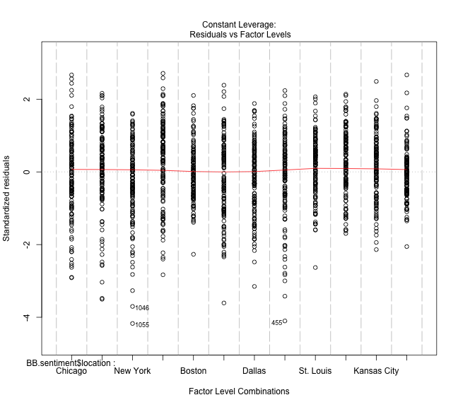 


