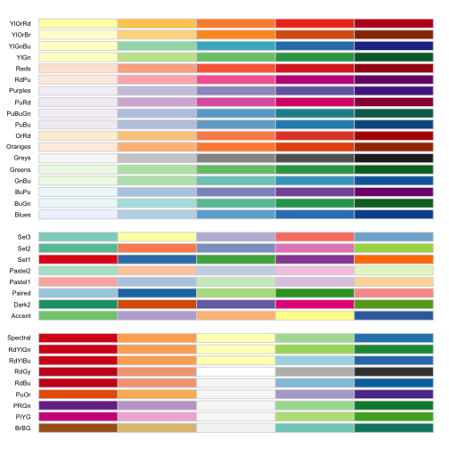
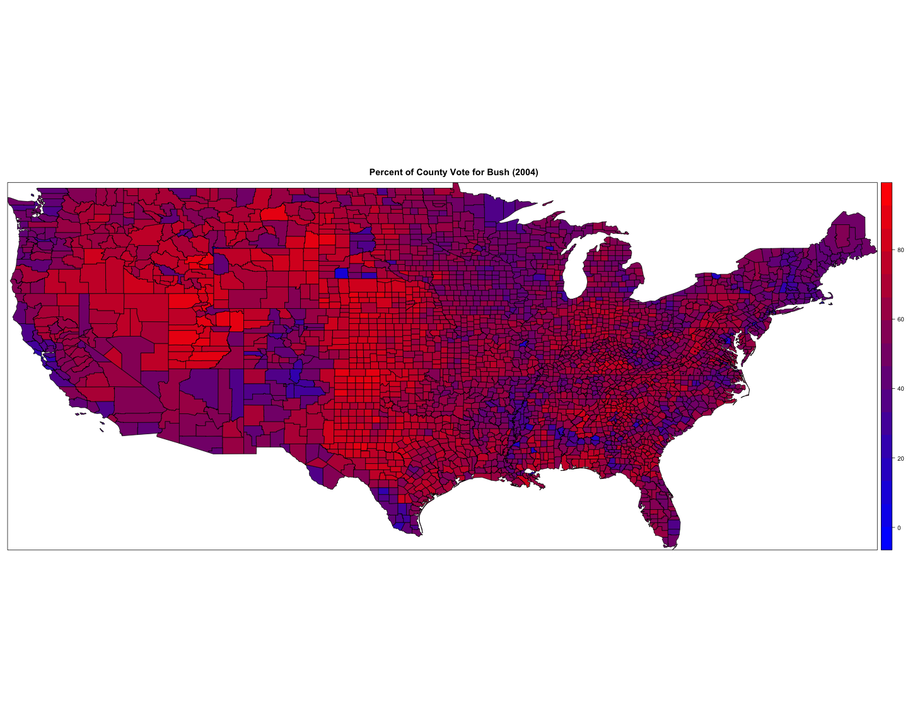
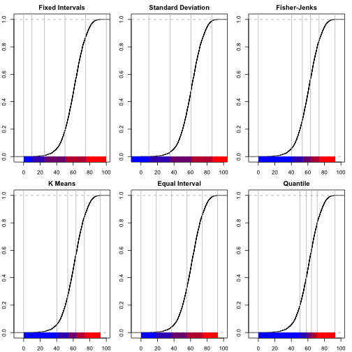
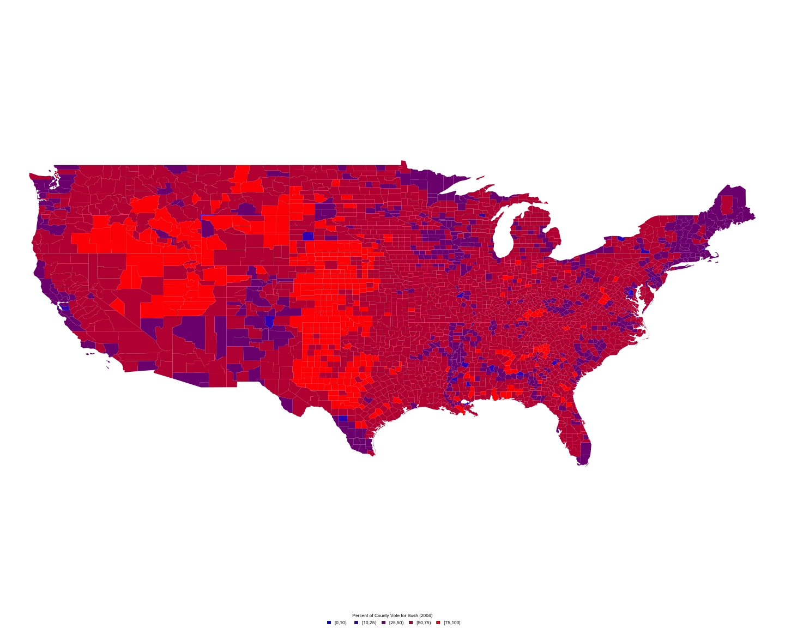
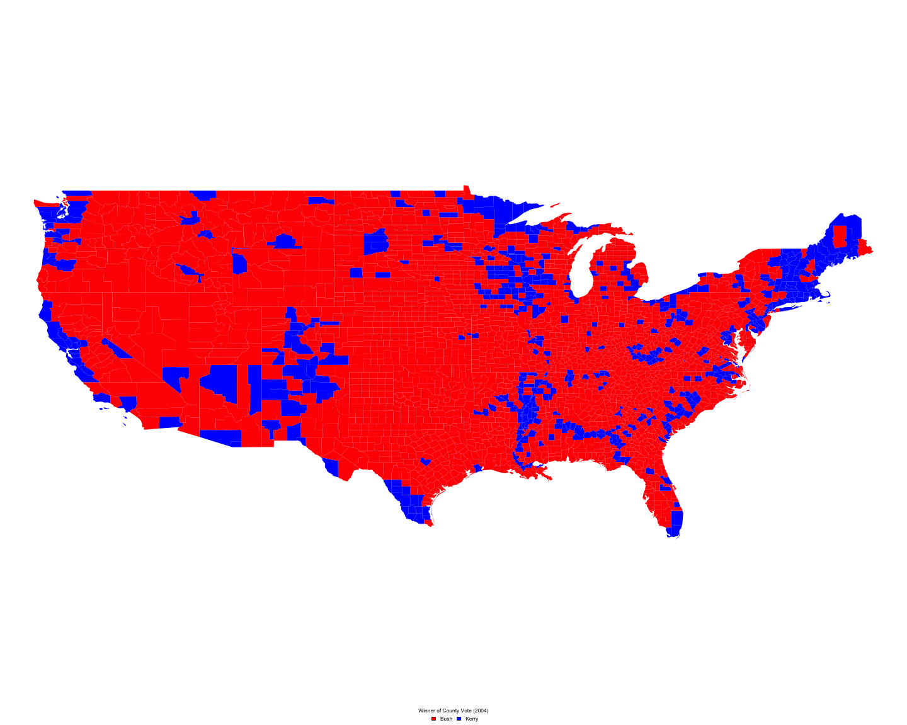
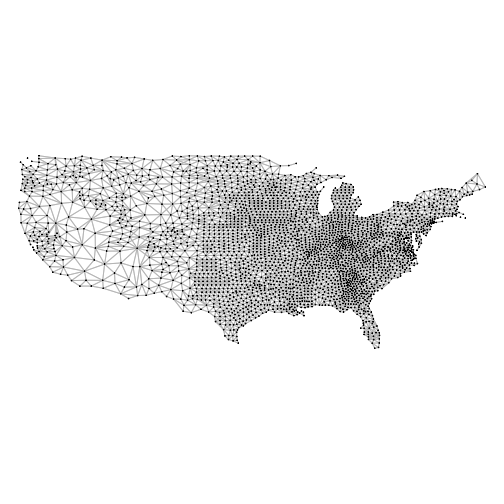

GES673 Lab @ UMBC by Richard Heimann
========================================================

***Dataset Background***

The datasets for this lab relate to voting results from the United States presidential election of 2004. The election was the 55th quadrennial presidential election. It was held on Tuesday, November 2, 2004. Republican Party candidate and incumbent President George W. Bush defeated Democratic Party candidate John Kerry, the then-junior Senator from Massachusetts.from the 2004 US presidential election - where Bush beat Kerry. 

***Nominee  George W. Bush (Republican), VP Cheney	John Kerry (Democratic), VP Edwards*** 

    *Electoral vote:	286[2]	    251[2][3]
    *States carried:	31	        19 + DC
    *Popular vote:	  62,040,610	59,028,444
    *Percentage:    	50.7%	      48.3%

Red State / Blue State (Famous Election Map): http://en.wikipedia.org/wiki/File:2004_US_elections_map_electoral_votes.png


```r
library(maps)  ## Projections
library(maptools)  ## Data management
```

```
## Loading required package: sp
## Checking rgeos availability: TRUE
```

```r
library(sp)  ## Data management
library(spdep)  ## Spatial autocorrelation
```

```
## Loading required package: Matrix
```

```r
library(gstat)  ## Geostatistics
```

```
## Error: there is no package called 'gstat'
```

```r
library(splancs)  ## Kernel Density
```

```
## 
## Spatial Point Pattern Analysis Code in S-Plus
##  
##  Version 2 - Spatial and Space-Time analysis
```

```r
library(spatstat)  ## Geostatistics
```

```
## 
## spatstat 1.36-0       (nickname: 'Intense Scrutiny') 
## For an introduction to spatstat, type 'beginner'
```

```r
library(pgirmess)  ## Spatial autocorrelation
library(RColorBrewer)  ## Visualization
library(classInt)  ## Class intervals
library(spgwr)  ## GWR
```

```
## NOTE: This package does not constitute approval of GWR
## as a method of spatial analysis; see example(gwr)
```


```r
setwd("/Users/heimannrichard/Google Drive/Spatial Analysis UMBC/RCode/spacestats/CodeData")
load("Datasets.RData")
ls()
```

```
## [1] "crime"    "dat88"    "election" "laos"     "mat88"    "volcano"
```

```r
save(laos, crime, cities, election, dat88, mat88, file = "Rspatial_lab.RData")
```

```
## Error: object 'cities' not found
```


```r
summary(election)
```

```
## Object of class SpatialPolygonsDataFrame
## Coordinates:
##        min    max
## r1 -124.73 -66.97
## r2   24.96  49.37
## Is projected: TRUE 
## proj4string :
## [+proj=lcc+lon_0=90w +lat_1=20n +lat_2=60n]
## Data attributes:
##          NAME         STATE_NAME     STATE_FIPS     CNTY_FIPS   
##  Washington:  32   Texas   : 254   48     : 254   001    :  48  
##  Jefferson :  26   Georgia : 159   13     : 159   003    :  48  
##  Franklin  :  25   Virginia: 136   51     : 136   005    :  48  
##  Jackson   :  24   Kentucky: 120   21     : 120   009    :  47  
##  Lincoln   :  24   Missouri: 115   29     : 115   007    :  46  
##  Madison   :  20   Kansas  : 105   20     : 105   011    :  46  
##  (Other)   :2960   (Other) :2222   (Other):2222   (Other):2828  
##       FIPS           AREA          FIPS_num          Bush       
##  01001  :   1   Min.   :    2   Min.   : 1001   Min.   :     0  
##  01003  :   1   1st Qu.:  435   1st Qu.:19048   1st Qu.:  2926  
##  01005  :   1   Median :  622   Median :29217   Median :  6357  
##  01007  :   1   Mean   :  965   Mean   :30699   Mean   : 19055  
##  01009  :   1   3rd Qu.:  931   3rd Qu.:46012   3rd Qu.: 15894  
##  01011  :   1   Max.   :20175   Max.   :56045   Max.   :954764  
##  (Other):3105                                                   
##      Kerry            County_F         Nader           Total        
##  Min.   :      0   Min.   :    0   Min.   :    0   Min.   :      0  
##  1st Qu.:   1778   1st Qu.:19042   1st Qu.:    0   1st Qu.:   4808  
##  Median :   4041   Median :29211   Median :   14   Median :  10407  
##  Mean   :  17940   Mean   :30656   Mean   :  145   Mean   :  37140  
##  3rd Qu.:  10418   3rd Qu.:46008   3rd Qu.:   67   3rd Qu.:  26552  
##  Max.   :1670341   Max.   :56045   Max.   :13251   Max.   :2625105  
##                                                                     
##     Bush_pct      Kerry_pct      Nader_pct        MDratio      
##  Min.   : 0.0   Min.   : 0.0   Min.   :0.000   Min.   :   0.0  
##  1st Qu.:52.7   1st Qu.:30.2   1st Qu.:0.000   1st Qu.:  37.3  
##  Median :61.2   Median :38.5   Median :0.302   Median :  65.6  
##  Mean   :60.6   Mean   :38.9   Mean   :0.401   Mean   :  93.0  
##  3rd Qu.:69.4   3rd Qu.:46.8   3rd Qu.:0.633   3rd Qu.: 117.5  
##  Max.   :92.8   Max.   :90.0   Max.   :4.467   Max.   :2189.5  
##                                                                
##       hosp          pcthisp         pcturban        urbrural   
##  Min.   : 0.00   Min.   :  0.0   Min.   :  0.0   Min.   :0.00  
##  1st Qu.: 1.30   1st Qu.:  4.0   1st Qu.:  0.0   1st Qu.:3.00  
##  Median : 3.29   Median :  8.0   Median : 33.4   Median :6.00  
##  Mean   : 5.67   Mean   : 44.5   Mean   : 35.3   Mean   :5.54  
##  3rd Qu.: 6.74   3rd Qu.: 24.0   3rd Qu.: 56.5   3rd Qu.:7.00  
##  Max.   :84.07   Max.   :972.0   Max.   :100.0   Max.   :9.00  
##                                                                
##     pctfemhh       pcincome        pctpoor        pctlt9ed   
##  Min.   : 0.0   Min.   :    0   Min.   : 0.0   Min.   : 0.0  
##  1st Qu.: 9.6   1st Qu.:15466   1st Qu.:11.0   1st Qu.: 8.9  
##  Median :12.2   Median :17448   Median :15.1   Median :13.2  
##  Mean   :13.0   Mean   :17788   Mean   :16.5   Mean   :14.3  
##  3rd Qu.:15.4   3rd Qu.:19818   3rd Qu.:20.4   3rd Qu.:18.7  
##  Max.   :41.1   Max.   :58096   Max.   :63.1   Max.   :56.3  
##                                                              
##     pcthsed         pctcoled       unemploy        pctwhtcl   
##  Min.   :  0.0   Min.   : 0.0   Min.   : 0.00   Min.   : 0.0  
##  1st Qu.: 61.1   1st Qu.: 9.0   1st Qu.: 3.90   1st Qu.:38.5  
##  Median : 71.2   Median :11.6   Median : 5.30   Median :43.5  
##  Mean   : 68.3   Mean   :13.1   Mean   : 5.87   Mean   :44.5  
##  3rd Qu.: 77.1   3rd Qu.:15.3   3rd Qu.: 7.20   3rd Qu.:50.7  
##  Max.   :100.0   Max.   :53.4   Max.   :37.90   Max.   :81.4  
##                                                               
##     homevalu           rent        popdens         crowded     
##  Min.   :     0   Min.   :  0   Min.   :    0   Min.   : 0.00  
##  1st Qu.: 35850   1st Qu.:255   1st Qu.:   15   1st Qu.: 1.80  
##  Median : 44400   Median :297   Median :   39   Median : 2.60  
##  Mean   : 52015   Mean   :313   Mean   :  194   Mean   : 3.61  
##  3rd Qu.: 58600   3rd Qu.:352   3rd Qu.:   93   3rd Qu.: 4.50  
##  Max.   :500001   Max.   :926   Max.   :53801   Max.   :44.40  
##                                                                
##     ginirev        SmokecurM        SmokevrM       SmokecurF    
##  Min.   :0.000   Min.   :0.000   Min.   :0.000   Min.   :0.000  
##  1st Qu.:0.390   1st Qu.:0.220   1st Qu.:0.490   1st Qu.:0.190  
##  Median :0.420   Median :0.240   Median :0.520   Median :0.210  
##  Mean   :0.413   Mean   :0.241   Mean   :0.505   Mean   :0.208  
##  3rd Qu.:0.440   3rd Qu.:0.270   3rd Qu.:0.540   3rd Qu.:0.240  
##  Max.   :0.580   Max.   :0.580   Max.   :0.780   Max.   :0.420  
##                                                                 
##     SmokevrF         Obese           Noins         XYLENES__M   
##  Min.   :0.000   Min.   :0.000   Min.   :0.000   Min.   :    0  
##  1st Qu.:0.390   1st Qu.:0.320   1st Qu.:0.100   1st Qu.:   27  
##  Median :0.420   Median :0.340   Median :0.120   Median :   58  
##  Mean   :0.412   Mean   :0.335   Mean   :0.129   Mean   :  222  
##  3rd Qu.:0.460   3rd Qu.:0.360   3rd Qu.:0.150   3rd Qu.:  170  
##  Max.   :0.630   Max.   :0.630   Max.   :0.410   Max.   :16661  
##                                                                 
##     TOLUENE        TETRACHLOR        STYRENE         NICKEL_COM   
##  Min.   :    0   Min.   :   0.0   Min.   :   0.0   Min.   : 0.00  
##  1st Qu.:   44   1st Qu.:   0.7   1st Qu.:   0.8   1st Qu.: 0.00  
##  Median :   91   Median :   1.9   Median :   1.8   Median : 0.01  
##  Mean   :  336   Mean   :  13.7   Mean   :  15.4   Mean   : 0.37  
##  3rd Qu.:  255   3rd Qu.:   6.6   3rd Qu.:   8.1   3rd Qu.: 0.11  
##  Max.   :28305   Max.   :1966.6   Max.   :1413.0   Max.   :69.01  
##                                                                   
##    METHYLENE_       MERCURY_CO      LEAD_COMPO       BENZENE__I  
##  Min.   :   0.0   Min.   :0.000   Min.   :  0.00   Min.   :   0  
##  1st Qu.:   1.6   1st Qu.:0.002   1st Qu.:  0.01   1st Qu.:  22  
##  Median :   3.9   Median :0.004   Median :  0.02   Median :  42  
##  Mean   :  26.4   Mean   :0.057   Mean   :  0.82   Mean   : 105  
##  3rd Qu.:  12.5   3rd Qu.:0.020   3rd Qu.:  0.23   3rd Qu.:  96  
##  Max.   :2764.2   Max.   :3.220   Max.   :290.63   Max.   :4612  
##                                                                  
##    ARSENIC_CO       POP2000          POP00SQMIL       MALE2000      
##  Min.   : 0.00   Min.   :      0   Min.   :    0   Min.   :      0  
##  1st Qu.: 0.00   1st Qu.:  11343   1st Qu.:   17   1st Qu.:   5583  
##  Median : 0.00   Median :  24747   Median :   43   Median :  12272  
##  Mean   : 0.11   Mean   :  89145   Mean   :  244   Mean   :  43726  
##  3rd Qu.: 0.02   3rd Qu.:  61896   3rd Qu.:  105   3rd Qu.:  30370  
##  Max.   :32.47   Max.   :9519338   Max.   :66934   Max.   :4704105  
##                                                                     
##    FEMALE2000         MAL2FEM         UNDER18          AIAN      
##  Min.   :      0   Min.   :  0.0   Min.   : 0.0   Min.   : 0.00  
##  1st Qu.:   5598   1st Qu.: 94.0   1st Qu.:23.7   1st Qu.: 0.20  
##  Median :  12512   Median : 97.0   Median :25.3   Median : 0.30  
##  Mean   :  45419   Mean   : 98.3   Mean   :25.5   Mean   : 1.61  
##  3rd Qu.:  31548   3rd Qu.:100.0   3rd Qu.:27.1   3rd Qu.: 0.80  
##  Max.   :4815233   Max.   :205.0   Max.   :45.3   Max.   :94.20  
##                                                                  
##       ASIA           BLACK            NHPI           WHITE     
##  Min.   : 0.00   Min.   : 0.00   Min.   :0.000   Min.   : 0.0  
##  1st Qu.: 0.20   1st Qu.: 0.30   1st Qu.:0.000   1st Qu.:77.1  
##  Median : 0.30   Median : 1.70   Median :0.000   Median :91.3  
##  Mean   : 0.77   Mean   : 8.83   Mean   :0.036   Mean   :84.7  
##  3rd Qu.: 0.70   3rd Qu.:10.10   3rd Qu.:0.100   3rd Qu.:96.7  
##  Max.   :30.80   Max.   :86.50   Max.   :1.500   Max.   :99.7  
##                                                                
##    AIAN_MORE       ASIA_MORE        BLK_MORE       NHPI_MORE     
##  Min.   : 0.00   Min.   : 0.00   Min.   : 0.00   Min.   :0.0000  
##  1st Qu.: 0.50   1st Qu.: 0.30   1st Qu.: 0.40   1st Qu.:0.0000  
##  Median : 0.80   Median : 0.50   Median : 2.10   Median :0.1000  
##  Mean   : 2.22   Mean   : 0.97   Mean   : 9.13   Mean   :0.0995  
##  3rd Qu.: 1.40   3rd Qu.: 0.90   3rd Qu.:10.70   3rd Qu.:0.1000  
##  Max.   :95.10   Max.   :32.60   Max.   :86.70   Max.   :2.6000  
##                                                                  
##     WHT_MORE       HISP_LAT       CH19902000      MEDAGE2000  
##  Min.   : 0.0   Min.   : 0.00   Min.   :-37.4   Min.   : 0.0  
##  1st Qu.:79.0   1st Qu.: 0.90   1st Qu.:  1.0   1st Qu.:35.2  
##  Median :92.6   Median : 1.80   Median :  8.4   Median :37.4  
##  Mean   :85.9   Mean   : 6.18   Mean   : 11.1   Mean   :37.3  
##  3rd Qu.:97.6   3rd Qu.: 5.10   3rd Qu.: 17.4   3rd Qu.:39.8  
##  Max.   :99.9   Max.   :97.50   Max.   :191.0   Max.   :54.3  
##                                                               
##    PEROVER65   
##  Min.   : 0.0  
##  1st Qu.:12.1  
##  Median :14.4  
##  Mean   :14.8  
##  3rd Qu.:17.1  
##  Max.   :34.7  
## 
```

```r
names(election)
```

```
##  [1] "NAME"       "STATE_NAME" "STATE_FIPS" "CNTY_FIPS"  "FIPS"      
##  [6] "AREA"       "FIPS_num"   "Bush"       "Kerry"      "County_F"  
## [11] "Nader"      "Total"      "Bush_pct"   "Kerry_pct"  "Nader_pct" 
## [16] "MDratio"    "hosp"       "pcthisp"    "pcturban"   "urbrural"  
## [21] "pctfemhh"   "pcincome"   "pctpoor"    "pctlt9ed"   "pcthsed"   
## [26] "pctcoled"   "unemploy"   "pctwhtcl"   "homevalu"   "rent"      
## [31] "popdens"    "crowded"    "ginirev"    "SmokecurM"  "SmokevrM"  
## [36] "SmokecurF"  "SmokevrF"   "Obese"      "Noins"      "XYLENES__M"
## [41] "TOLUENE"    "TETRACHLOR" "STYRENE"    "NICKEL_COM" "METHYLENE_"
## [46] "MERCURY_CO" "LEAD_COMPO" "BENZENE__I" "ARSENIC_CO" "POP2000"   
## [51] "POP00SQMIL" "MALE2000"   "FEMALE2000" "MAL2FEM"    "UNDER18"   
## [56] "AIAN"       "ASIA"       "BLACK"      "NHPI"       "WHITE"     
## [61] "AIAN_MORE"  "ASIA_MORE"  "BLK_MORE"   "NHPI_MORE"  "WHT_MORE"  
## [66] "HISP_LAT"   "CH19902000" "MEDAGE2000" "PEROVER65"
```

```r
data <- election
```


```r
# proj4string(data) <- CRS('+proj=lcc+lon_0=90w +lat_1=20n +lat_2=60n')
summary(data)[1:4]
```

```
## $class
## [1] "SpatialPolygonsDataFrame"
## attr(,"package")
## [1] "sp"
## 
## $bbox
##        min    max
## r1 -124.73 -66.97
## r2   24.96  49.37
## 
## $is.projected
## [1] TRUE
## 
## $proj4string
## [1] "+proj=lcc+lon_0=90w +lat_1=20n +lat_2=60n"
```


```r
par(mar = c(0, 0, 0, 0))
plot(data)
```

 


```r
# Look at some of the options
par(mar = c(0, 3, 0, 0), cex = 0.6)
display.brewer.all(n = 5)
```

 

```r

# Create blue-state red-state palette
br.palette <- colorRampPalette(c("blue", "red"), space = "rgb")
br.palette(5)
```

```
## [1] "#0000FF" "#3F00BF" "#7F007F" "#BF003F" "#FF0000"
```


```r
# Let's plot the % of vote for Bush
data <- election
var <- data$Bush_pct
summary(var)
```

```
##    Min. 1st Qu.  Median    Mean 3rd Qu.    Max. 
##     0.0    52.7    61.2    60.6    69.4    92.8
```


## What is the mean vote for Bush? What was reported above? Is there a difference? If so, WHY? 


```r
# Easy but unflexible option
spplot(data, zcol = "Bush_pct", col.regions = br.palette(100), main = "Percent of County Vote for Bush (2004)")
```

 


## What general patterns do you detect? Are you able to determine some smooth and rough patterns? 


```r
# This section hopefully gives more intuition about plotting and
# specifically classification for symbol classes.

# Define number of colors in a palette
pal <- br.palette(n = 5)

# Class intervals for symbol classes
classes_fx <- classIntervals(var, n = 5, style = "fixed", fixedBreaks = c(0, 
    10, 25, 50, 75, 100), rtimes = 1)
classes_sd <- classIntervals(var, n = 5, style = "sd", rtimes = 1)
classes_fi <- classIntervals(var, n = 5, style = "fisher", rtimes = 3)
classes_eq <- classIntervals(var, n = 5, style = "equal", rtimes = 1)
classes_km <- classIntervals(var, n = 5, style = "kmeans", rtimes = 1)
classes_qt <- classIntervals(var, n = 5, style = "quantile", rtimes = 1)

# Class intervals for symbol classes (print values)
classes_fx
```

```
## style: fixed
##   [0,10)  [10,25)  [25,50)  [50,75) [75,100] 
##        4       22      563     2119      403
```

```r
classes_sd
```

```
## style: sd
## [-15.96,9.563)  [9.563,35.08)   [35.08,60.6)   [60.6,86.12)  [86.12,111.6] 
##              4             93           1398           1583             33
```

```r
classes_fi
```

```
## style: fisher
##     [0,40.28) [40.28,53.32) [53.32,63.26) [63.26,73.55) [73.55,92.83] 
##           187           646           938           858           482
```

```r
classes_eq
```

```
## style: equal
##     [0,18.57) [18.57,37.13)  [37.13,55.7)  [55.7,74.26) [74.26,92.83] 
##            15           116           899          1641           440
```

```r
classes_km
```

```
## style: kmeans
##     [0,40.28) [40.28,53.37)  [53.37,63.3)  [63.3,73.59) [73.59,92.83] 
##           187           647           940           857           480
```

```r
classes_qt
```

```
## style: quantile
##     [0,50.52) [50.52,58.07) [58.07,64.37) [64.37,71.31) [71.31,92.83] 
##           622           622           622           622           623
```

```r

# Class intervals for symbol classes (plot values) || Take some time to
# compare the impact of the various class intervals.
par(mar = c(2, 2, 2, 1) + 0.1, mfrow = c(2, 3))
plot(classes_fx, pal = pal, main = "Fixed Intervals", xlab = "", ylab = "")
plot(classes_sd, pal = pal, main = "Standard Deviation", xlab = "", ylab = "")
plot(classes_fi, pal = pal, main = "Fisher-Jenks", xlab = "", ylab = "")
plot(classes_km, pal = pal, main = "K Means", xlab = "", ylab = "")
plot(classes_eq, pal = pal, main = "Equal Interval", xlab = "", ylab = "")
plot(classes_qt, pal = pal, main = "Quantile", xlab = "", ylab = "")
```

 


```r
# plot using fixed intervals
cols <- findColours(classes_fx, pal)

par(mar = rep(0, 4))
plot(election, col = cols, border = NA)
legend(x = "bottom", cex = 0.7, fill = attr(cols, "palette"), bty = "n", legend = names(attr(cols, 
    "table")), title = "Percent of County Vote for Bush (2004)", ncol = 5)
```

 


```r
# We have been using percent vote which is a continuous variable. Now lets
# plot a categorical variable, specifically a # binary variable for winning
# vote for Bush/Kerry respectively (Red/Blue).

# We are creating a new data object of class 'character' that has the RGB
# values for red and blue or if bush > kerry (red) # and if kerry > bush
# (blue).
binary.cols <- ifelse(data$Bush > data$Kerry, "red", "blue")
class(binary.cols)
```

```
## [1] "character"
```

```r

par(mar = rep(0, 4))
# We now map cols and add a legend
plot(election, col = binary.cols, border = NA)
legend(x = "bottom", cex = 0.7, fill = c("red", "blue"), bty = "n", legend = c("Bush", 
    "Kerry"), title = "Winner of County Vote (2004)", ncol = 2)
```

 


## Spatial Autocorrelation


```r
map_crd <- coordinates(data)

## Contiguity Neighbors

W_cont_el <- poly2nb(data, queen = T)
W_cont_el_mat <- nb2listw(W_cont_el, style = "W", zero.policy = TRUE)
```


```r
## Plot the connections

par(mar = rep(0, 4))
plot(W_cont_el_mat, coords = map_crd, pch = 19, cex = 0.1, col = "gray")
```

 


