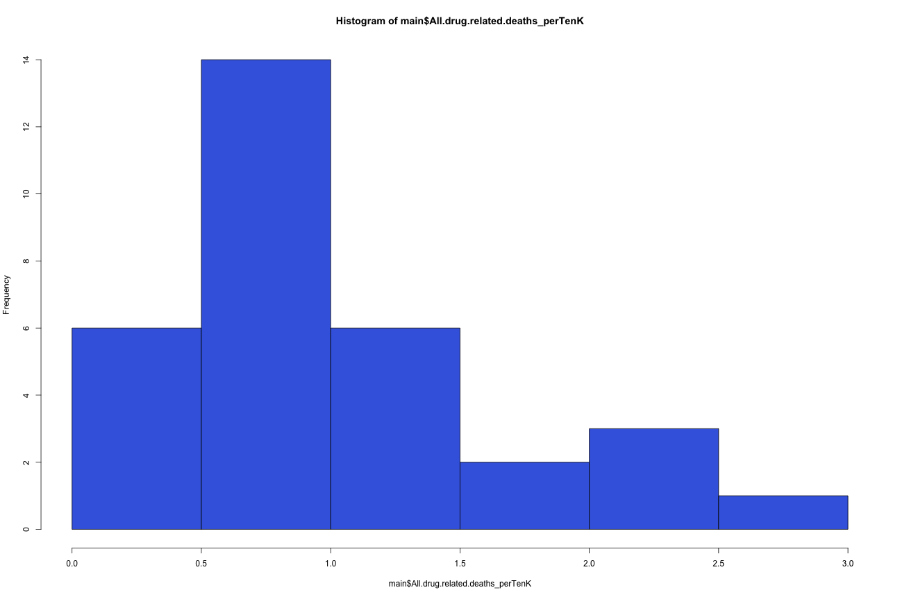
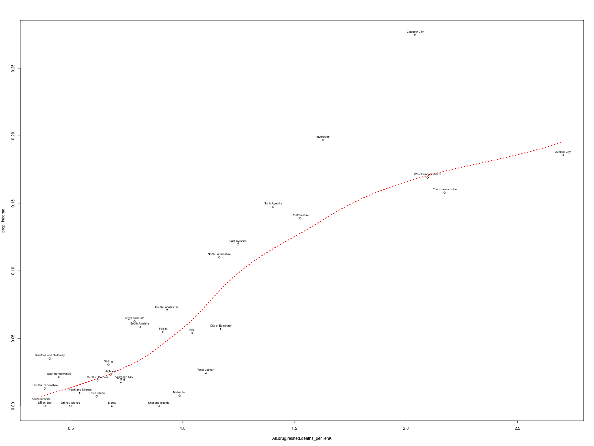
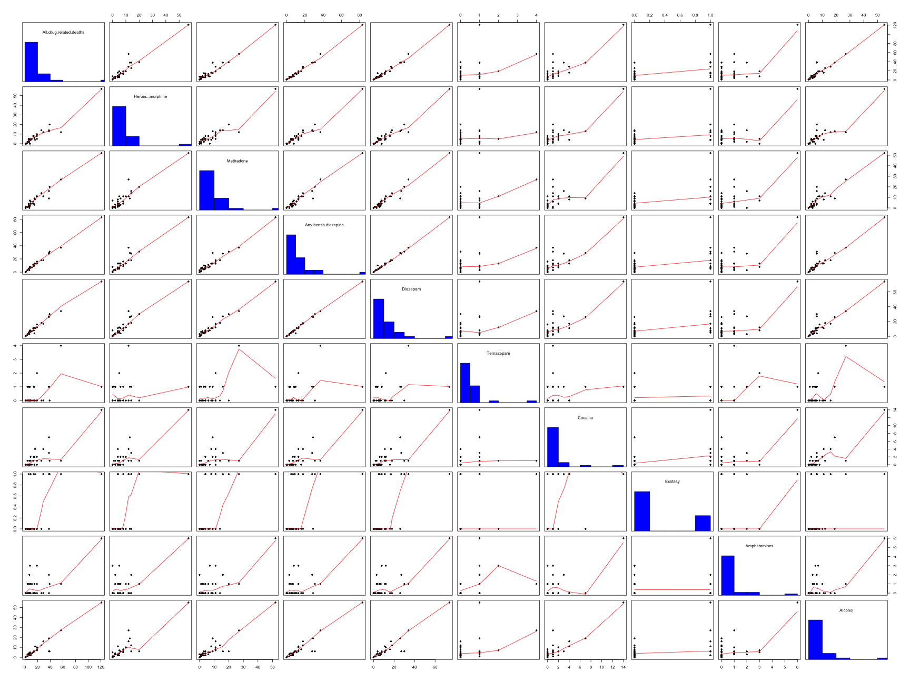
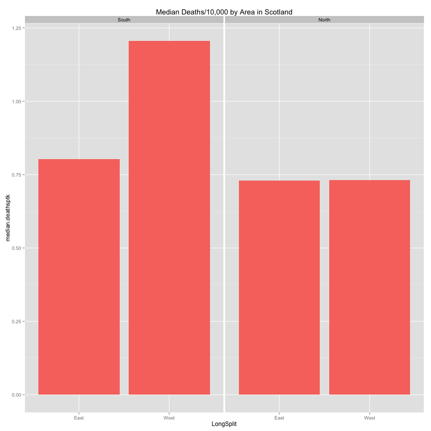
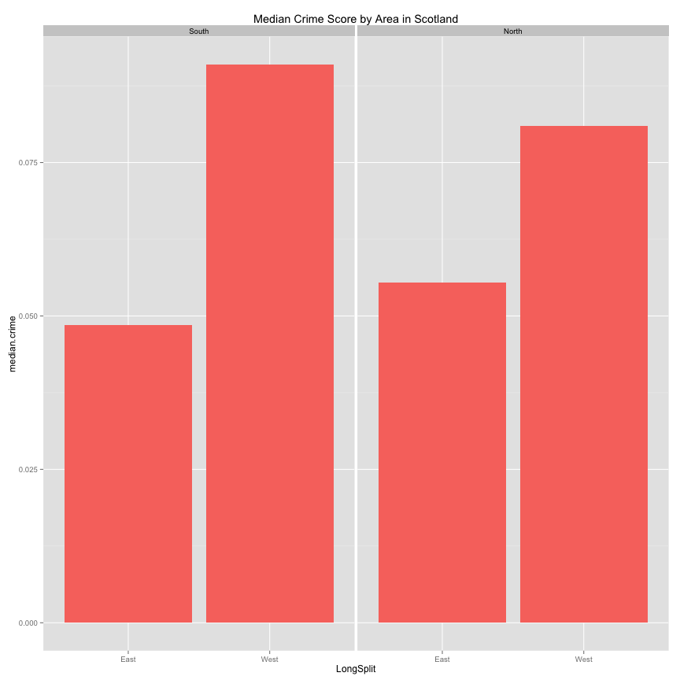
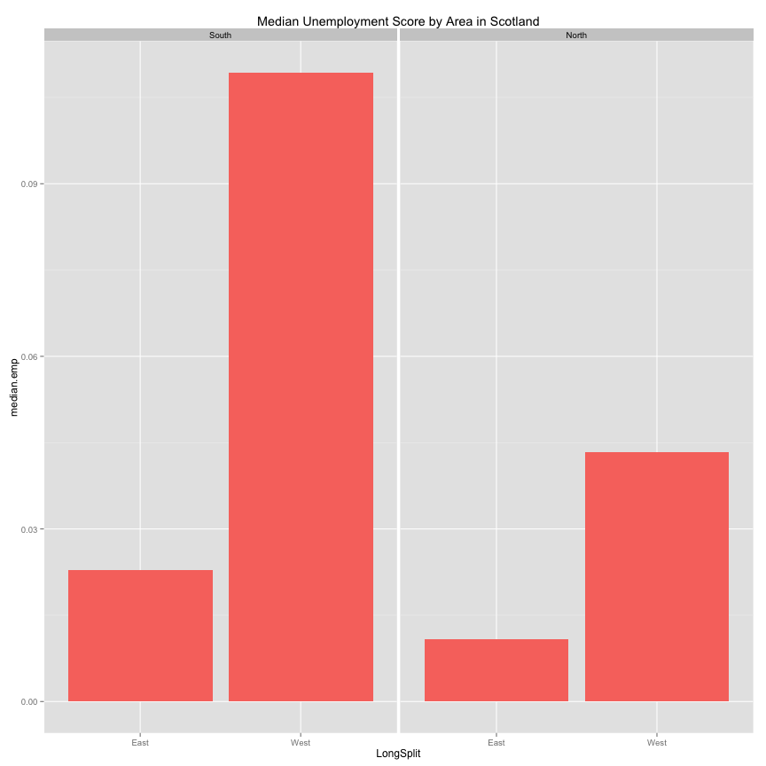
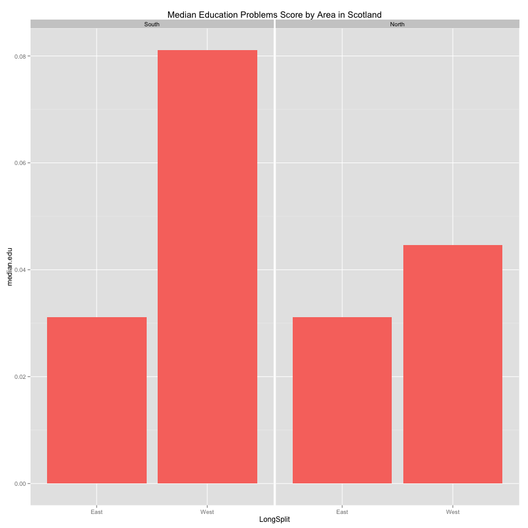

GES673 Lab @ UMBC by Richard Heimann
========================================================

***Introduction***

Data analysis is like an interrogation. That is, the interviewer hopes to use a series of questions in order to discover information - if not the truth. The questions the interrogator asks, of course, are subjectively chosen, at least initially. In time however, questions are selected based on question utility i.e. those questions that produce maximum yield. As such, the information that one interrogator gets out of an interrogatee might be fairly different from the information that another interviewer gets out of the same person. That is, the efficacy of one will be different than another based on experience. Exploratory /Spatial/ Data Analysis (EDA/ESDA) provides the data analyst the intuition to interrogate data to maximize information yield. EDA/ESDA provides some efficient ways to gracefully handle datasets of unknown information yield akin to an interrogatee of unknown origin or influence or guilt. The appetite for information, from both an interrogator and a data analyst sometimes leads to over analysis or torture of their subject respectively. The result is that both subjects subsequently speak in unreliable ways. The lab is an R exercise, which hopefully adds more pragmatic and systematic description of the process. That said, the commands (and thus the analysis) below are not the only way of analyzing the data. When you understand what the commands are doing, you might decide to take a different approach to analyzing the data - please do so, and be sure to share what you find!

***Dataset Background***

The datasets, for this lab relate to council areas in Scotland (roughly equivalent to counties). The one which I have labeled 'main' has numbers representing the number of drug related deaths by council area, with most of its columns containing counts that relate to specific drugs. It also contains geographical coordinates of the council areas, in latitude and longitude. The one which I have labeled 'pop' contains population numbers. The rest of the datasets contain numbers relating to problems with crime, education, employment, health, and income. The datasets contain proportions in them, such that values closer to 1 indicate that the council area is more troubled, while values closer to 0 indicate that the council area is less troubled in that particular way.


```r
# install.packages('dplyr', repos='http://cran.us.r-project.org')
library(dplyr)
```

```
## 
## Attaching package: 'dplyr'
## 
## The following objects are masked from 'package:stats':
## 
##     filter, lag
## 
## The following objects are masked from 'package:base':
## 
##     intersect, setdiff, setequal, union
```

```r
# install.packages('stats', repos='http://cran.us.r-project.org')
library(stats)
```


```r
# Set working directory
setwd("/Users/heimannrichard/Google Drive/GIS Data/drugdata_scotland")
# Loading all the datasets
main <- read.csv("2012-drugs-related-cx.csv")
pop <- read.csv("scotland pop by ca.csv")
crime <- read.csv("most_deprived_datazones_by_council_(crime)_2012.csv")
edu <- read.csv("most_deprived_datazones_by_council_(education)_2012.csv")
emp <- read.csv("most_deprived_datazones_by_council_(employment)_2012.csv")
health <- read.csv("most_deprived_datazones_by_council_(health)_2012.csv")
income <- read.csv("most_deprived_datazones_by_council_(income)_2012.csv")
```


```r
# Explorattion by indexing the data
names(main)
```

```
##  [1] "Council.area"            "All.drug.related.deaths"
##  [3] "Heroin...morphine"       "Methadone"              
##  [5] "Any.benzo.diazepine"     "Diazepam"               
##  [7] "Temazepam"               "Cocaine"                
##  [9] "Ecstasy"                 "Amphetamines"           
## [11] "Alcohol"                 "Latitude"               
## [13] "Longitude"
```

```r
main$Council.area
```

```
##  [1] Aberdeen City         Aberdeenshire         Angus                
##  [4] Argyll and Bute       Clackmannanshire      Dumfries and Galloway
##  [7] Dundee City           East Ayrshire         East Dunbartonshire  
## [10] East Lothian          East Renfrewshire     City of Edinburgh    
## [13] Eilean Siar           Falkirk               Fife                 
## [16] Glasgow City          Highland              Inverclyde           
## [19] Midlothian            Moray                 North Ayrshire       
## [22] North Lanarkshire     Orkney Islands        Perth and Kinross    
## [25] Renfrewshire          Scottish Borders      Shetland Islands     
## [28] South Ayrshire        South Lanarkshire     Stirling             
## [31] West Dunbartonshire   West Lothian         
## 32 Levels: Aberdeen City Aberdeenshire Angus ... West Lothian
```

```r
main$Council.area[1:10]
```

```
##  [1] Aberdeen City         Aberdeenshire         Angus                
##  [4] Argyll and Bute       Clackmannanshire      Dumfries and Galloway
##  [7] Dundee City           East Ayrshire         East Dunbartonshire  
## [10] East Lothian         
## 32 Levels: Aberdeen City Aberdeenshire Angus ... West Lothian
```

```r
main[1:10, 1]
```

```
##  [1] Aberdeen City         Aberdeenshire         Angus                
##  [4] Argyll and Bute       Clackmannanshire      Dumfries and Galloway
##  [7] Dundee City           East Ayrshire         East Dunbartonshire  
## [10] East Lothian         
## 32 Levels: Aberdeen City Aberdeenshire Angus ... West Lothian
```


```r
# Merging other relevant data with the main dataset
main <- merge(main, pop[, c(2, 3)], by.x = "Council.area", by.y = "Council.area", 
    all.x = TRUE)
main <- merge(main, crime[, c(1, 4)], by.x = "Council.area", by.y = "label", 
    all.x = TRUE)
main <- merge(main, edu[, c(1, 4)], by.x = "Council.area", by.y = "label", all.x = TRUE)
main <- merge(main, emp[, c(1, 4)], by.x = "Council.area", by.y = "label", all.x = TRUE)
main <- merge(main, health[, c(1, 4)], by.x = "Council.area", by.y = "label", 
    all.x = TRUE)
main <- merge(main, income[, c(1, 4)], by.x = "Council.area", by.y = "label", 
    all.x = TRUE)
```


## 1. Provide a few sentences about drug related deaths? You can find this information by performing some desktop research. e.g. Google Search, Google Scholar, UMBC Library


```r
# Weighting the number of drug related deaths by the population of each
# council area new variable named All.drug.related.deaths_perTenK (drug
# deaths / (population/10,000))
main$All.drug.related.deaths_perTenK <- (main$All.drug.related.deaths/(main$Population/10000))
```


```r
# A histogram of the number of drug related deaths per 10,000 people
hist(main$All.drug.related.deaths_perTenK, col = "royal blue")
```

 


## 2. How is a histogram useful?
## 3. What emerges when examining the univariate histogram of drug related deaths / 10,000?


```r
# Q-Q plots are another way to check for normality. As our histogram
# suggested we have a non-normal distrubution
qqnorm(main$All.drug.related.deaths_perTenK)
qqline(main$All.drug.related.deaths_perTenK)
```

 


```r
# scatterplot (drug deaths ~ income)
with(main, scatter.smooth(All.drug.related.deaths_perTenK, prop_income, lpars = list(col = "red", 
    lwd = 3, lty = 3)))
text(main$All.drug.related.deaths_perTenK, main$prop_income, labels = main$Council.area, 
    cex = 0.7, pos = 3)
```

 


## 4a.  What appears to be the largest bivariate outlier? Where is it located? e.g: North, South, East or West?
## 4b.  Are there any other observations that demand further investigation? If so, which and why? 


```r
# Simple summary stats of one variable at a time
mean(main$All.drug.related.deaths)
```

```
## [1] 18.16
```

```r
median(main$All.drug.related.deaths)
```

```
## [1] 10
```

```r
mean(main$All.drug.related.deaths_perTenK)
```

```
## [1] 1.011
```

```r
median(main$All.drug.related.deaths_perTenK)
```

```
## [1] 0.8504
```

```r
# Summary stats of all the variables in the dataset
summary(main)
```

```
##             Council.area All.drug.related.deaths Heroin...morphine
##  Aberdeen City    : 1    Min.   :  1.0           Min.   : 0.00    
##  Aberdeenshire    : 1    1st Qu.:  6.0           1st Qu.: 3.50    
##  Angus            : 1    Median : 10.0           Median : 5.00    
##  Argyll and Bute  : 1    Mean   : 18.2           Mean   : 7.59    
##  City of Edinburgh: 1    3rd Qu.: 19.0           3rd Qu.: 8.50    
##  Clackmannanshire : 1    Max.   :121.0           Max.   :57.00    
##  (Other)          :26                                             
##    Methadone     Any.benzo.diazepine    Diazepam       Temazepam    
##  Min.   : 0.00   Min.   : 0.0        Min.   : 0.00   Min.   :0.000  
##  1st Qu.: 2.00   1st Qu.: 5.0        1st Qu.: 4.75   1st Qu.:0.000  
##  Median : 4.00   Median : 7.5        Median : 7.00   Median :0.000  
##  Mean   : 7.91   Mean   :13.1        Mean   :12.06   Mean   :0.469  
##  3rd Qu.:11.00   3rd Qu.:13.8        3rd Qu.:13.00   3rd Qu.:1.000  
##  Max.   :52.00   Max.   :83.0        Max.   :74.00   Max.   :4.000  
##                                                                     
##     Cocaine        Ecstasy       Amphetamines      Alcohol     
##  Min.   : 0.0   Min.   :0.000   Min.   :0.000   Min.   : 0.00  
##  1st Qu.: 0.0   1st Qu.:0.000   1st Qu.:0.000   1st Qu.: 2.00  
##  Median : 1.0   Median :0.000   Median :0.000   Median : 4.50  
##  Mean   : 1.5   Mean   :0.281   Mean   :0.781   Mean   : 7.53  
##  3rd Qu.: 2.0   3rd Qu.:1.000   3rd Qu.:1.000   3rd Qu.: 7.25  
##  Max.   :14.0   Max.   :1.000   Max.   :6.000   Max.   :55.00  
##                                                                
##     Latitude      Longitude      Population       prop_crime    
##  Min.   :55.1   Min.   :1.27   Min.   : 20100   Min.   :0.0000  
##  1st Qu.:55.8   1st Qu.:3.05   1st Qu.: 89425   1st Qu.:0.0386  
##  Median :56.0   Median :3.77   Median :116550   Median :0.0665  
##  Mean   :56.4   Mean   :3.75   Mean   :163194   Mean   :0.0719  
##  3rd Qu.:56.5   3rd Qu.:4.50   3rd Qu.:183350   3rd Qu.:0.0908  
##  Max.   :60.3   Max.   :7.02   Max.   :592800   Max.   :0.1596  
##                                                                 
##  prop_education   prop_employment   prop_health      prop_income    
##  Min.   :0.0000   Min.   :0.0000   Min.   :0.0000   Min.   :0.0000  
##  1st Qu.:0.0221   1st Qu.:0.0127   1st Qu.:0.0120   1st Qu.:0.0121  
##  Median :0.0445   Median :0.0412   Median :0.0341   Median :0.0328  
##  Mean   :0.0596   Mean   :0.0667   Mean   :0.0638   Mean   :0.0652  
##  3rd Qu.:0.0962   3rd Qu.:0.1090   3rd Qu.:0.1041   3rd Qu.:0.1124  
##  Max.   :0.2491   Max.   :0.2624   Max.   :0.2950   Max.   :0.2745  
##                                                                     
##  All.drug.related.deaths_perTenK
##  Min.   :0.366                  
##  1st Qu.:0.619                  
##  Median :0.850                  
##  Mean   :1.011                  
##  3rd Qu.:1.191                  
##  Max.   :2.703                  
## 
```


## 5. What can you tell about the mean of drug related deaths?
## 6. What can you share about the summary of summary(main)?


```r
# A Scatterplot matrix
pairs(~All.drug.related.deaths_perTenK + Latitude + Longitude + prop_crime + 
    prop_education + prop_employment + prop_income + prop_health, data = main)
```

 


```r
# scatterplot matrix wiht some extra (note panel.hist function run in
# echo=FALSE mode))
colnames(main)
```

```
##  [1] "Council.area"                    "All.drug.related.deaths"        
##  [3] "Heroin...morphine"               "Methadone"                      
##  [5] "Any.benzo.diazepine"             "Diazepam"                       
##  [7] "Temazepam"                       "Cocaine"                        
##  [9] "Ecstasy"                         "Amphetamines"                   
## [11] "Alcohol"                         "Latitude"                       
## [13] "Longitude"                       "Population"                     
## [15] "prop_crime"                      "prop_education"                 
## [17] "prop_employment"                 "prop_health"                    
## [19] "prop_income"                     "All.drug.related.deaths_perTenK"
```

```r
pairs(main[2:11], panel = panel.smooth, cex = 1, pch = 20, bg = "blue", diag.panel = panel.hist, 
    cex.labels = 1, font.labels = 1)
```

 


## 7. In what ways can a scatterplot matrix be useful? In what ways can it be used incorrectly or inefficeintly? 


```r
# We split our dataset into two regions for subsequent analysis. We perform
# a median split of the longitudes of the council # areas resulting in an
# 'east' and 'west' group.  ?cut: divides the range of x into intervals and
# codes the values in x according to which interval they fall. The leftmost
# # interval corresponds to level one, the next leftmost to level two and so
# on.
main$LongSplit <- cut(main$Longitude, breaks = quantile(main$Longitude, c(0, 
    0.5, 1)), include.lowest = TRUE, right = FALSE, ordered_result = TRUE, labels = c("East", 
    "West"))
```


```r
# Let's examine the number of records that result in each group:
table(main$LongSplit)
```

```
## 
## East West 
##   16   16
```


```r
# We split our dataset into two regions for subsequent analysis. We perform
# a median split of the longitudes of the council # areas resulting in an
# 'north' and 'south' group.  ?cut: divides the range of x into intervals
# and codes the values in x according to which interval they fall. The
# leftmost # interval corresponds to level one, the next leftmost to level
# two and so on.
main$LatSplit <- cut(main$Latitude, breaks = quantile(main$Latitude, c(0, 0.5, 
    1)), include.lowest = TRUE, right = FALSE, ordered_result = TRUE, labels = c("South", 
    "North"))
```


```r
# Let's examine the number of records that result in each group:
table(main$LatSplit)
```

```
## 
## South North 
##    16    16
```


```r
data_source <- collect(main)
grouping_factors <- group_by(main, LongSplit, LatSplit)
deaths_by_area <- summarise(grouping_factors, median.deathsptk = median(All.drug.related.deaths_perTenK), 
    median.crime = median(prop_crime), median.emp = median(prop_employment), 
    median.edu = median(prop_education), num.council.areas = length(All.drug.related.deaths_perTenK))
```


```r
# Examine the summary table just created
grouping_factors
```

```
## Source: local data frame [32 x 22]
## Groups: LongSplit, LatSplit
## 
##             Council.area All.drug.related.deaths Heroin...morphine
## 1          Aberdeen City                      16                 4
## 2          Aberdeenshire                       9                 4
## 3                  Angus                       8                 5
## 4        Argyll and Bute                       7                 4
## 5      City of Edinburgh                      57                12
## 6       Clackmannanshire                      11                 5
## 7  Dumfries and Galloway                       6                 4
## 8            Dundee City                      39                20
## 9          East Ayrshire                      15                 6
## 10   East Dunbartonshire                       4                 1
## 11          East Lothian                       6                 2
## 12     East Renfrewshire                       4                 2
## 13           Eilean Siar                       1                 0
## 14               Falkirk                      14                 8
## 15                  Fife                      38                14
## 16          Glasgow City                     121                57
## 17              Highland                      15                 6
## 18            Inverclyde                      13                 8
## 19            Midlothian                       8                 0
## 20                 Moray                       6                 4
## 21        North Ayrshire                      19                10
## 22     North Lanarkshire                      38                13
## 23        Orkney Islands                       1                 0
## 24     Perth and Kinross                       8                 4
## 25          Renfrewshire                      26                14
## 26      Scottish Borders                       7                 2
## 27      Shetland Islands                       2                 0
## 28        South Ayrshire                       9                 4
## 29     South Lanarkshire                      29                12
## 30              Stirling                       6                 5
## 31   West Dunbartonshire                      19                 8
## 32          West Lothian                      19                 5
## Variables not shown: Methadone (int), Any.benzo.diazepine (int), Diazepam
##   (int), Temazepam (int), Cocaine (int), Ecstasy (int), Amphetamines
##   (int), Alcohol (int), Latitude (dbl), Longitude (dbl), Population (int),
##   prop_crime (dbl), prop_education (dbl), prop_employment (dbl),
##   prop_health (dbl), prop_income (dbl), All.drug.related.deaths_perTenK
##   (dbl), LongSplit (fctr), LatSplit (fctr)
```

```r
deaths_by_area
```

```
## Source: local data frame [4 x 7]
## Groups: LongSplit
## 
##   LongSplit LatSplit median.deathsptk median.crime median.emp median.edu
## 1      East    South           0.8032      0.04846    0.02281    0.03107
## 2      East    North           0.7302      0.05543    0.01077    0.03111
## 3      West    South           1.2061      0.09100    0.10934    0.08112
## 4      West    North           0.7308      0.08100    0.04339    0.04465
## Variables not shown: num.council.areas (int)
```


```r
# Now we'll make some fun plots of the summary table

library(ggplot2)

qplot(LongSplit, median.deathsptk, data = deaths_by_area, facets = ~LatSplit, 
    geom = "bar", stat = "identity", fill = "dark red", main = "Median Deaths/10,000 by Area in Scotland") + 
    theme(legend.position = "none")
```

 

```r

qplot(LongSplit, median.crime, data = deaths_by_area, facets = ~LatSplit, geom = "bar", 
    stat = "identity", fill = "dark red", main = "Median Crime Score by Area in Scotland") + 
    theme(legend.position = "none")
```

 

```r

qplot(LongSplit, median.emp, data = deaths_by_area, facets = ~LatSplit, geom = "bar", 
    stat = "identity", fill = "dark red", main = "Median Unemployment Score by Area in Scotland") + 
    theme(legend.position = "none")
```

 

```r

qplot(LongSplit, median.edu, data = deaths_by_area, facets = ~LatSplit, geom = "bar", 
    stat = "identity", fill = "dark red", main = "Median Education Problems Score by Area in Scotland") + 
    theme(legend.position = "none")
```

 


## 8. What can we tell from these plots? Take a paragraph or so to share your thoughts. 


****Some Online R Resources****

https://github.com/rheimann/UMBC
Github is a social code repository. The link above is to where the code for this and other labs are stored. 

http://www.r-bloggers.com
If you are interested in R this is where you will find yourself spending alot of your time. The site shares multiple blogs a day of varied topics. 

http://stackoverflow.com/questions/tagged/r 
StackOverflow is a great site to go to for help. 


```r
sessionInfo()
```

```
## R version 3.0.2 (2013-09-25)
## Platform: x86_64-apple-darwin10.8.0 (64-bit)
## 
## locale:
## [1] en_US.UTF-8/en_US.UTF-8/en_US.UTF-8/C/en_US.UTF-8/en_US.UTF-8
## 
## attached base packages:
## [1] stats     graphics  grDevices utils     datasets  methods   base     
## 
## other attached packages:
## [1] ggplot2_0.9.3.1 dplyr_0.1.3     knitr_1.5      
## 
## loaded via a namespace (and not attached):
##  [1] assertthat_0.1     colorspace_1.2-4   dichromat_2.0-0   
##  [4] digest_0.6.4       evaluate_0.5.1     formatR_0.10      
##  [7] grid_3.0.2         gtable_0.1.2       labeling_0.2      
## [10] MASS_7.3-29        munsell_0.4.2      plyr_1.8          
## [13] proto_0.3-10       RColorBrewer_1.0-5 Rcpp_0.11.0       
## [16] reshape2_1.2.2     scales_0.2.3       stringr_0.6.2     
## [19] tools_3.0.2
```


